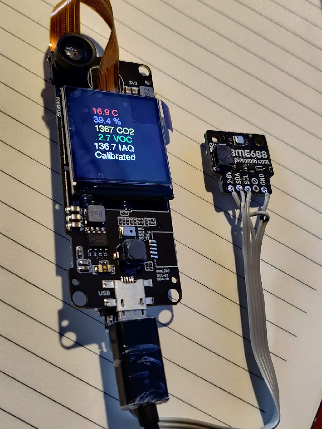
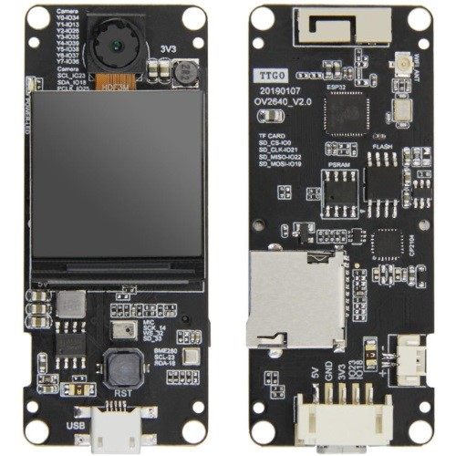

# TTGO-T-Camera-Plus-EspHome-BME688

Followed ESPHome instructions here to create initial configuration:

Install ESPHome manually: https://esphome.io/guides/installing_esphome.html
Create test project: https://esphome.io/guides/getting_started_command_line.html
Bonus: ESPHome dashboard: http://localhost:6052/

BME68x sensor API: https://github.com/BoschSensortec/BME68x-Sensor-API
BME688 software: https://www.bosch-sensortec.com/software-tools/software/bme688-software/
display documentation: https://github.com/esphome/feature-requests/issues/901
display limitation: https://github.com/esphome/feature-requests/issues/901

Working configuration: [livingroom.yaml](./config/livingroom.yaml)

TTGO T-Camera Plus Pin Assignment

Pin assignment for the TTGO T-Camera Plus.

## Camera

Type: OV2640

|Name|GPIO|
|----|----|
|PWDN_GPIO_NUM    |-1|
|RESET_GPIO_NUM   |-1|
|XCLK_GPIO_NUM    |4|
|SIOD_GPIO_NUM    |18|
|SIOC_GPIO_NUM    |23|
|Y9_GPIO_NUM      |36|
|Y8_GPIO_NUM      |37|
|Y7_GPIO_NUM      |38|
|Y6_GPIO_NUM      |39|
|Y5_GPIO_NUM      |35|
|Y4_GPIO_NUM      |26|
|Y3_GPIO_NUM      |13|
|Y2_GPIO_NUM      |34|
|VSYNC_GPIO_NUM   |5|
|HREF_GPIO_NUM    |27|
|PCLK_GPIO_NUM    |25|

## TFT Display

Controller: ST77879 
Resolution: 240x240 RGB pixels

|Name|GPIO|
|----|----|
|MISO |22 |
|MOS-I|19 |
|SCLK |21 |
|CS  |12  |
|DC  |15  |
|BK  |2   |

## I2C Conector

|T-Camera|BME688|
|-|-|
|5V      |n/c|
|Gnd     |Gnd|
|3v3     |2-6v|
|IO23    |SDA|
|IO18    |SCL|

Online information: https://github.com/lewisxhe/esp32-camera-screen
